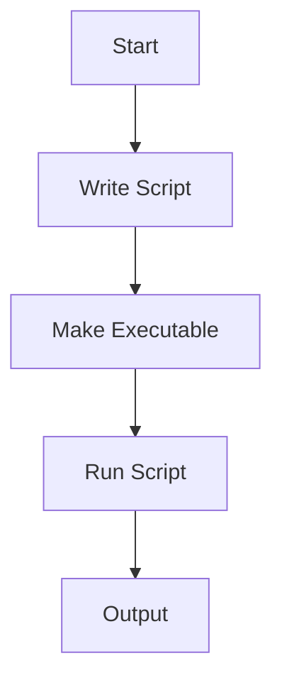

# Shell Scripting Basics

## Introduction to Shell Scripting

Shell scripting allows you to automate tasks in Unix-like operating systems using a sequence of shell commands stored in a file. The most common shell is **Bash** (Bourne Again SHell), available on both Ubuntu and CentOS.

---

## Writing and Executing Scripts

1. **Create a Script File**
    ```bash
    nano myscript.sh
    ```
2. **Add Shebang**
    ```bash
    #!/bin/bash
    echo "Hello, World!"
    ```
3. **Make Script Executable**
    ```bash
    chmod +x myscript.sh
    ```
4. **Run the Script**
    ```bash
    ./myscript.sh
    ```

> **Note:** The above steps are identical for Ubuntu and CentOS.

---

## Variables, Loops, and Conditionals

### Variables

```bash
name="Alice"
echo "Hello, $name"
```

### Loops

**For Loop:**
```bash
for i in 1 2 3; do
  echo "Number $i"
done
```

**While Loop:**
```bash
count=1
while [ $count -le 3 ]; do
  echo "Count is $count"
  ((count++))
done
```

### Conditionals

```bash
if [ "$name" = "Alice" ]; then
  echo "Welcome, Alice!"
else
  echo "You are not Alice."
fi
```

---

## Automating Tasks with Scripts

Shell scripts can automate backups, user management, software installation, and more.

**Example: Automated Backup**
```bash
#!/bin/bash
tar -czvf backup_$(date +%F).tar.gz /home/user/Documents
```

---

## Advanced Use Cases

- **Monitoring Disk Usage**
- **Automated Log Rotation**
- **Batch User Creation**

**Example: Monitor Disk Usage**
```bash
#!/bin/bash
usage=$(df -h / | awk 'NR==2 {print $5}')
echo "Disk usage: $usage"
if [[ ${usage%\%} -gt 80 ]]; then
  echo "Warning: Disk usage above 80%!"
fi
```

---

## Sample Enterprise Scripts

### 1. User Creation Script

```bash
#!/bin/bash
for user in user1 user2 user3; do
  sudo useradd $user
  echo "User $user created."
done
```
> **Note:** On Ubuntu, you may need `sudo`; on CentOS, ensure you have root privileges.

### 2. Service Status Checker

```bash
#!/bin/bash
services="nginx sshd"
for svc in $services; do
  systemctl status $svc
done
```
> **Note:** Service names may differ (e.g., `sshd` on CentOS, `ssh` on Ubuntu).

---

## Diagrams

### Script Execution Flow



---

## Ubuntu vs CentOS Differences

- **Package Managers:** `apt` (Ubuntu), `yum` or `dnf` (CentOS)
- **Service Names:** Some services have different names (e.g., `sshd` vs `ssh`)
- **Default Shell:** Both use Bash by default, but always check with `echo $SHELL`

---

## References

- [Bash Scripting Guide](https://www.gnu.org/software/bash/manual/bash.html)
- [Ubuntu Shell Scripting](https://help.ubuntu.com/community/Beginners/BashScripting)
- [CentOS Documentation](https://wiki.centos.org/HowTos/Bash)
